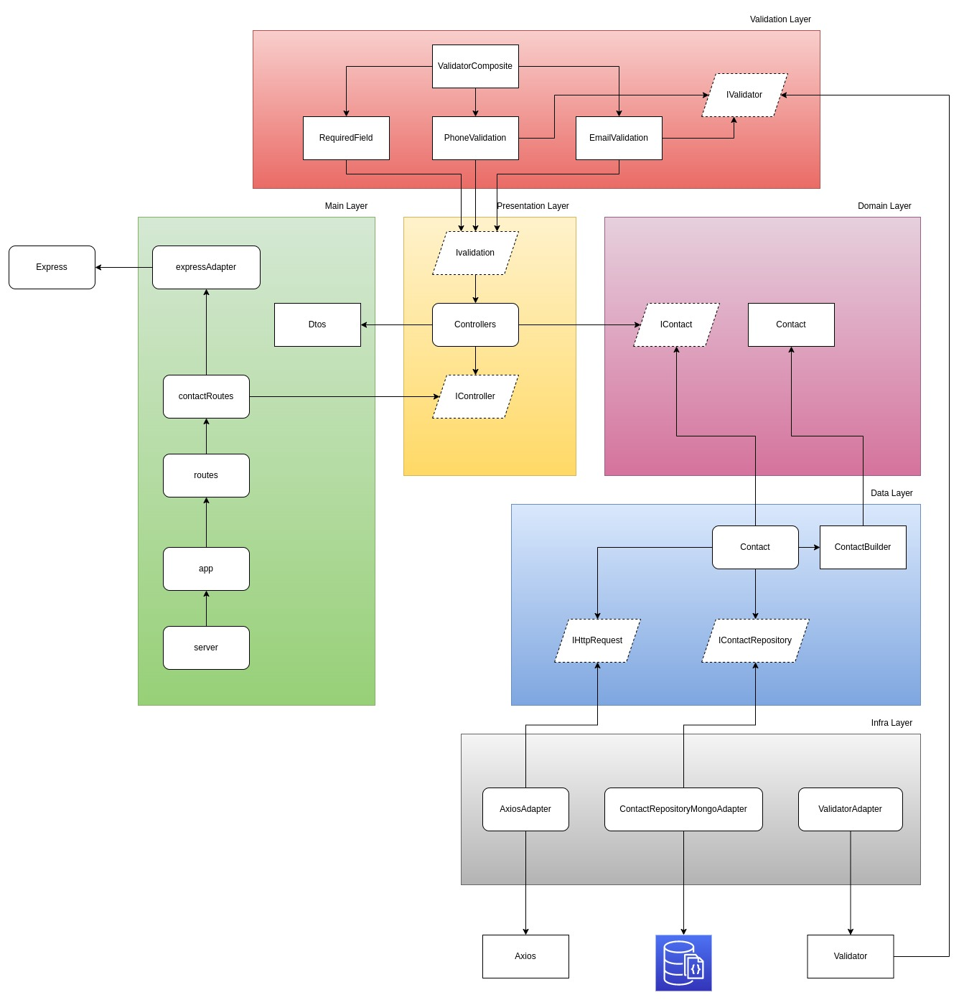

[](https://coveralls.io/github/renatops1991/phonebook-service?branch=main)


## Phonebook Service
The phonebook service is a phone contact API. Where you can create, 
update and search contact data bringing together weather forecast data from the HG Brasil 

## Installation
```bash
cp example.env .env

npm install

npm run build
```

## Running application
```bash
# run docker
docker compose up

# run with node
npm run start:dev
```

## Running tests
```bash
# Running all tests
npm run test

# Running unit tests
npm run test:unit

# Running integration tests
npm run test:e2e
```

## Architecture


## Documentation
After running the application, you can access the documentation, through the url `http://localhost:3001/docs`